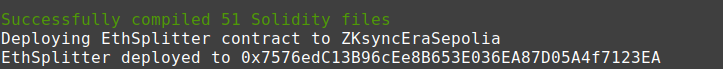
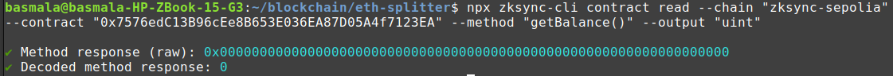
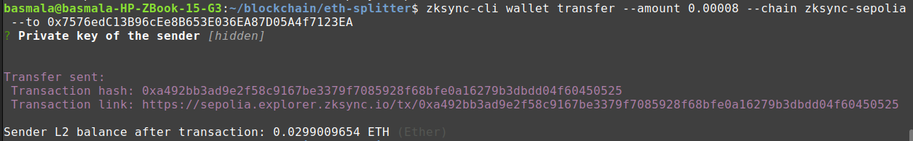

# Smart Contract for Splitting Ether using ZKsync

This project was scaffolded with [zksync-cli](https://github.com/matter-labs/zksync-cli).

I am using my wallet on meta mask & ZKsync Sepolia Testnet for this project.

## Progress

- `npm run compile`: Compiles contracts.
- `npm run deploy`: Deploys using script `/deploy/deploy.ts`.

I'll use this address later for interacting with the contract.
- Interacting: 
    - Using getBalance() : `npx zksync-cli contract read --chain "zksync-sepolia" --contract "0x7576edC13B96cEe8B653E036EA87D05A4f7123EA" --method "getBalance()" --output "uint"`
    
    - Transfering Ether : `zksync-cli wallet transfer --amount 0.00008 --chain zksync-sepolia --to 0x7576edC13B96cEe8B653E036EA87D05A4f7123EA`
    
    View the transaction [here](https://sepolia.explorer.zksync.io/tx/0xa492bb3ad9e2f58c9167be3379f7085928f68bfe0a16279b3dbdd04f60450525)
- Next : interact.ts
### Environment Settings

To keep private keys safe, this project pulls in environment variables from `.env` files. Primarily, it fetches the wallet's private key.

Rename `.env.example` to `.env` and fill in your private key:

```
WALLET_PRIVATE_KEY=your_private_key_here...
```

### Network Support

`hardhat.config.ts` comes with a list of networks to deploy and test contracts. Add more by adjusting the `networks` section in the `hardhat.config.ts`. To make a network the default, set the `defaultNetwork` to its name. You can also override the default using the `--network` option, like: `hardhat test --network dockerizedNode`.

### Local Tests

Running `npm run test` by default runs the [ZKsync In-memory Node](https://docs.zksync.io/build/test-and-debug/in-memory-node) provided by the [@matterlabs/hardhat-zksync-node](https://docs.zksync.io/build/tooling/hardhat/hardhat-zksync-node) tool.

Important: ZKsync In-memory Node currently supports only the L2 node. If contracts also need L1, use another testing environment like Dockerized Node. Refer to [test documentation](https://docs.zksync.io/build/test-and-debug) for details.

## Useful Links

- [Docs](https://docs.zksync.io/build)
- [Official Site](https://zksync.io/)
- [GitHub](https://github.com/matter-labs)
- [Twitter](https://twitter.com/zksync)
- [Discord](https://join.zksync.dev/)

## License

This project is under the [MIT](./LICENSE) license.